# Milestone 4 – Angular Frontend Implementation

**Course:** Web Application Development  
**Application Name:** Community Resource & Event Management System  
**Author:** ADEWALE OLAOMO  
**Date:** 7 March 2026   

---

## Project Overview

The Community Resource and Event Management System is a website that helps groups like churches and non-profits. It also helps clubs and student organizations. These groups use the Community Resource and Event Management System to manage things they share and to schedule events. The Community Resource and Event Management System is really useful, for community organizations.

Many small organizations use spreadsheets, emails or handwritten lists to manage resources like meeting rooms, projectors and books.
This can cause problems.
For example it can lead to scheduling conflicts.
People might not know if a room or item is available.
It can also lead to miscommunication.
Items can get misplaced.
These approaches are not ideal.
They make it hard to keep track of resources.
Organizations need a way to manage resources.

This system provides a centralized digital solution that allows users to view resources, manage events, and track availability using a modern web interface.
The backend system was implemented in **Node.js with Express and MySQL**, while the frontend client developed for this milestone was built using **Angular**.
The Angular client communicates with the backend REST API to retrieve, create, update, and delete application data.

**ScreenCast URL:** https://www.loom.com/share/135a4c4755ab42be8569e2b656c6245e

**MileStone 4 Code URL:** https://github.com/whaleswqeb/Milestone4Code-Report/tree/main/Milestone4Code%26Report/Code 

---

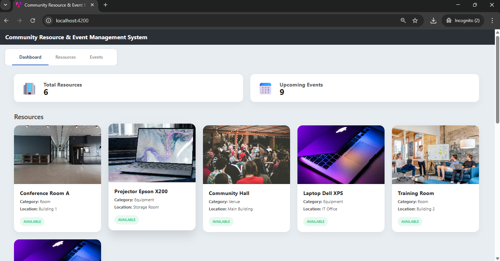  

**Home Page of Angular Application**

# 1. Introduction

Milestone 4 is, about building the Angular frontend application.
This application will work with the REST API that we created in the milestone.
The **Angular frontend application** will talk to the REST API.
We are focusing on developing the **Angular frontend application** in this milestone.
It will interact with the REST API.

The Angular client gives an interface that lets users work with the system.
It has forms, tables and navigation parts.
Users can interact with these to use the system.
The interface is made with Angular.
It helps users to do tasks.

This milestone demonstrates the integration between:

- Angular frontend
- Node.js backend
- MySQL database

The Angular application consumes the backend API using HTTP requests and displays the retrieved data dynamically.

Key objectives of this milestone include:

• Building a functional Angular client application  
• Connecting the Angular client to the backend REST API  
• Implementing CRUD functionality in the user interface  
• Providing navigation between different application views  
• Displaying data retrieved from the backend database  

This milestone completes the first full-stack version of the Community Resource & Event Management System.

---

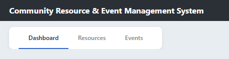

**Angular Application Navigation Menu**

# 2. Angular Application Architecture

The Angular client follows a modular architecture that separates responsibilities between components and services.
The major layers of the Angular application include:

**Component Layer**  
Responsible for user interface rendering and user interaction.

**Service Layer**  
Handles communication between the Angular client and the backend API.

**Routing Layer**  
Controls navigation between application pages.

**Model Layer**  
Defines TypeScript interfaces used to structure application data.

## Component Structure

The Angular application includes several primary components:

**Dashboard Component**  
Displays an overview of resources and events.

**Resource List Component**  
Displays all resources available in the system.

**Resource Form Component**  
Allows users to create and edit resources.

**Event List Component**  
Displays all scheduled events.

**Event Form Component**  
Allows users to create and update events.  
Each component communicates with the service layer to retrieve or modify backend data.

---

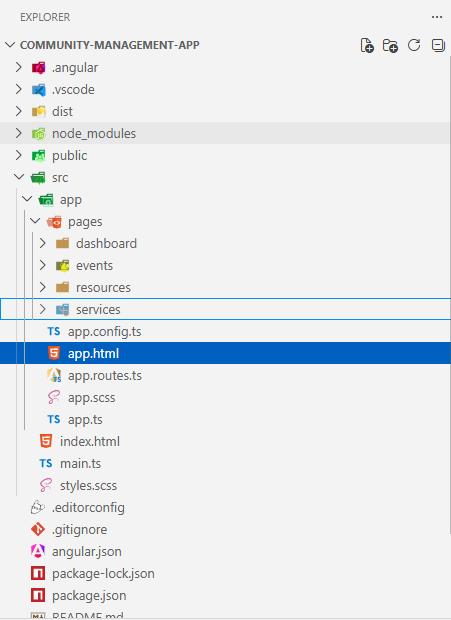  

**Angular Project Folder Structure**

# 3. Angular Routing

Angular routing allows users to navigate between application pages without reloading the browser.  
Routes were configured to map URL paths to specific Angular components.  
Example routes include:

**/dashboard**  
Displays the main application dashboard.

**/resources**  
Displays the list of available resources.

**/resources/create**  
Allows the user to create a new resource.

**/events**  
Displays all scheduled events.

**/events/create**  
Allows the user to create a new event.

Angular's RouterModule manages these routes and dynamically loads the appropriate component when the user navigates to a specific path.
This approach creates a smooth user experience similar to a desktop application.

---

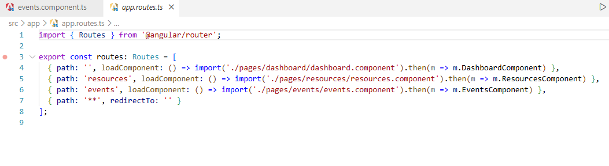
**Application Navigation Between Pages**

# 4. Angular Service Layer

The team used Angular services to deal with talking to the backend REST API. They did this so that the Angular services could handle all the communication with the backend REST API. This made it easier for the Angular services to get data from the backend REST API and send data back to the backend REST API. The Angular services were very important because they helped the application talk, to the backend REST API.

The service layer keeps HTTP requests from UI components.
It gives us methods to interact with backend endpoints.
This way the service layer acts as a bridge, between the UI and backend.
The service layer makes it easy to work with endpoints.

The primary service created for this application is:
**ResourceEventService**

This service uses Angular's HttpClient module to perform HTTP operations.  
Example methods implemented include:

**getResources()**  
retrieve all resources from the backend

**getResourceById(id)**  
retrieve a specific resource

**createResource(resource)**  
create a new resource

**updateResource(resource)**  
update an existing resource

**deleteResource(id)**  
delete a resource

Similar methods were created for managing event data.
Using a service layer improves maintainability and allows multiple components to share backend communication logic.

---

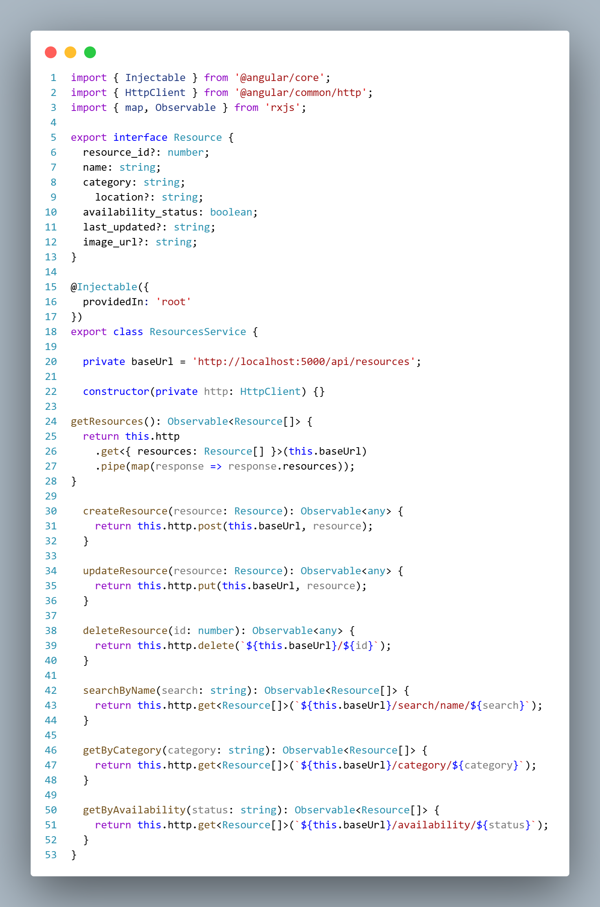

**Angular Resource Service Implementation**

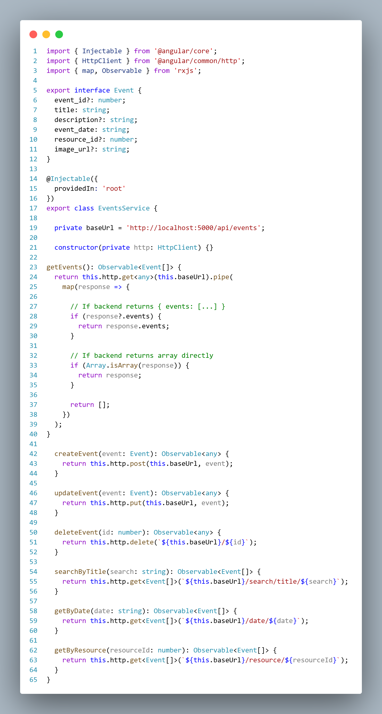

**Angular Event Service Implementation**

# 5. Resource Management Interface

The Resource Management interface is where users can look at the resources that are stored in the database. They can also make resources change the ones that are already there and get rid of the ones they do not need anymore. This is all done with the Resource Management interface.  
The Resource List component gets the information about resources from the backend API. Then shows this information in a table that is easy to understand. The Resource List component is really good, at taking the resource data and making it simple to look at. The resource data that the Resource List component gets is shown in a nice table format.
Each row of the table displays information about a specific resource, including:

* Resource Name  
* Category  
* Availability Status  
* Location  
* Associated Image

People can do things with the things listed in the table. They can use buttons to change or get rid of resources.  
This way of doing things makes it easy for the people, in charge to manage all the resources that people share at work.

---

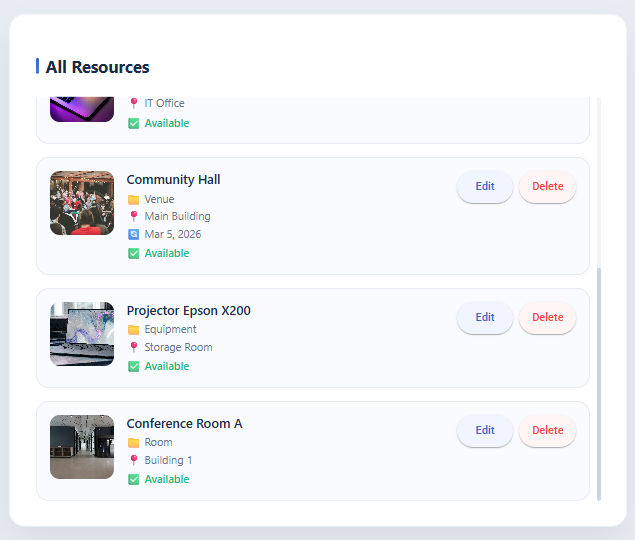

**Resource List Page**

# 6. Resource Creation Form

The application has a form where users can make resources.
The form asks for some details, about each resource including:

* Resource Name  
* Category  
* Availability Status  
* Location  
* Image URL

When we talk about forms we are talking about something that helps us get information, from the user and make sure everything is correct before we send it to the backend API. Angular forms are really important because they help us capture what the user is telling us and validate the fields that we need to have filled in. This way we can be sure that the data we send to the backend API is good and complete. We use forms to get user input and check the required fields.  
When the user submits the form, the Angular service sends a POST request to the API endpoint:

**POST /api/resources**  
The backend API then puts the resource into the MySQL database.
When this is done the application sends the user back, to the resource list.

---

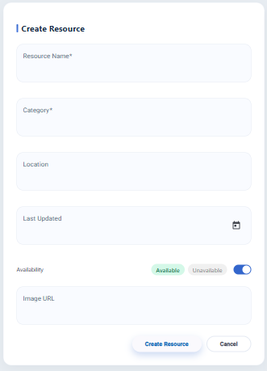

**Create Resource Form**

# 7. Event Management Interface

The Event Management page is where you can see all the events that are scheduled in the system and you can also manage these events. You can use the Event Management page to look at the events and make any changes you need to make to the events.  
Each event includes information such as:

* Event Title  
* Event Date  
* Associated Resource  
* Event Description

The events are shown in a table so people can see what is happening soon.
The application makes sure that these events are connected to things that already exist like rooms or equipment by using a link, in the database that ties these events to these things.  
Users can edit or delete events using buttons located within the table.

---

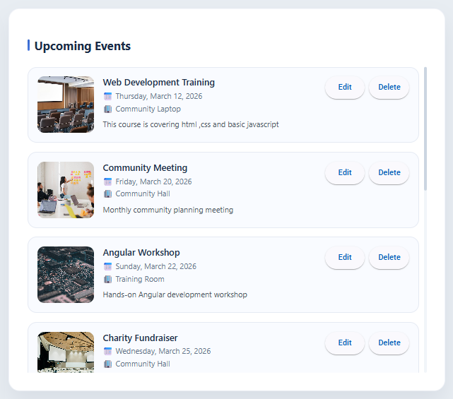

**Event List Page**

# 8. Event Creation Form

The Event Creation form allows users to schedule new events within the system.  
Users must provide the following information:

* Event Title  
* Event Date  
* Associated Resource  
* Description

The resource selection field gets a list of resources, from the system. Shows them in a dropdown menu.
This means users can only pick resources that're actually in the system when they assign events to a resource. The resource selection field helps with this by showing valid resources in the dropdown menu.  
When submitted, the form sends a POST request to:

**POST /api/events**

The backend API stores the event in the database. It makes sure that the relationship between resources is okay. This is done with the help of the key constraint that is already in place, for the database. The backend API maintains this relationship so that the resources and the event are connected properly in the database.

---

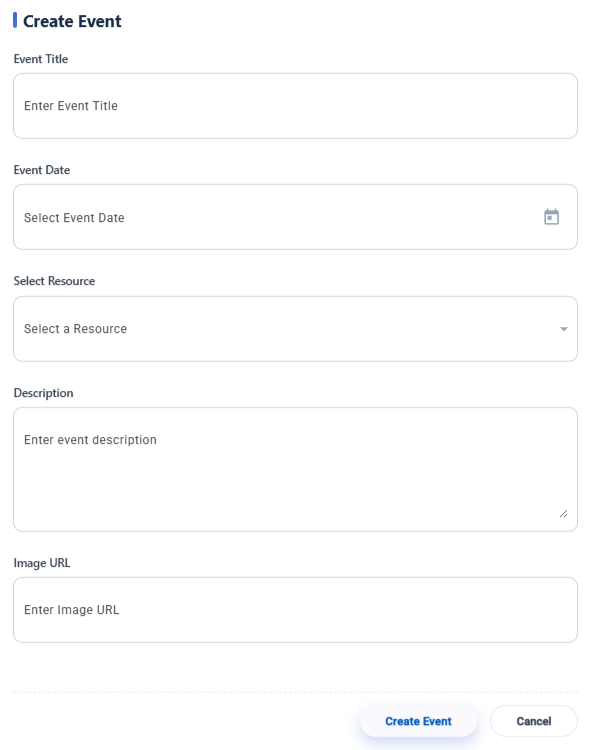

**Create Event Form**

# 9. Backend Integration

The Angular part works with the Node.js part using REST API.
We use REST API to make requests between the Angular and Node.js parts.
The Angular interface lets you do all Create, Read, Update, Delete things.
When you do these things in Angular it sends HTTP requests to the Node.js server.
Or more simply:
* The Angular. Node.js backend work together using REST API requests.
* All Create, Read, Update, Delete operations in Angular send requests, to the Node.js server.

Examples include:

* GET requests to retrieve data  
* POST requests to create new records  
* PUT requests to update records  
* DELETE requests to remove records

The backend handles these requests and talks to the MySQL database.
The API sends back JSON answers, which are then shown in a way, in the Angular app.
This integration shows a full-stack web app setup.

---

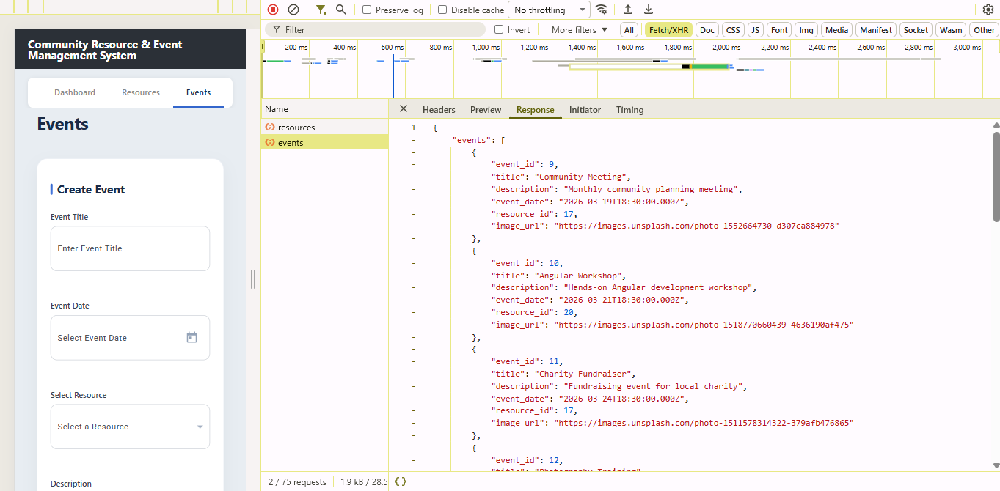

**Network Requests in Browser Developer Tools**

# 10. Testing and Validation

We did some testing to make sure the frontend works properly with the backend API and the database. The testing was done to check that the frontend and the backend API and database all work together correctly.  
The following operations were tested:  
* Viewing resources  
* Creating resources  
* Editing resources  
* Deleting resources  
* Viewing events  
* Creating events  
* Editing events  
* Deleting events

All operations were verified through both the Angular interface and the database using MySQL Workbench.
Additionally, API requests were inspected using browser developer tools to confirm correct HTTP requests and responses.
The results confirmed that the system functions correctly as a full-stack web application.

---

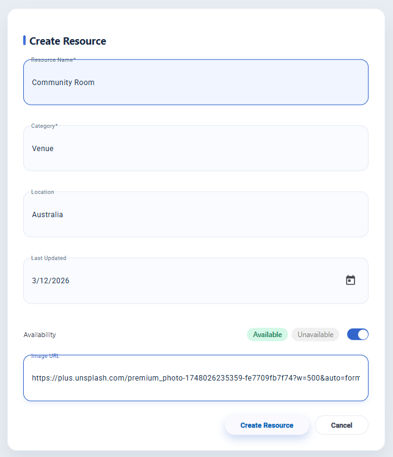

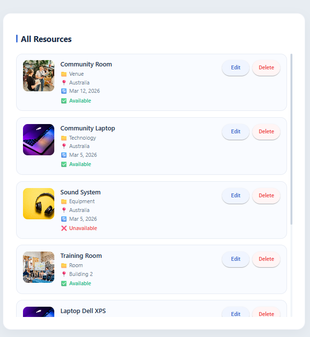

**Successful Resource Creation**

# 11. Conclusion

Milestone 4 is done.
It implemented the Angular frontend client for the Community Resource and Event Management System.
The Angular frontend client was a part of this milestone.
Community Resource and Event Management System now has a working frontend.  
The Angular application is really helpful because it gives community organizations a way to manage their resources and schedule events. This makes things a lot easier for them. The Angular application is very good, at letting community organizations handle their resources and events in a way.  
The system now works well because we connected the frontend to the Node.js backend API and the MySQL database. This means the system can do everything it needs to with resources and events. It can create them read them update them and delete them. The system supports CRUD functionality, for both resources and events.  
The application follows modern web development best practices including:

* Component-based architecture  
* Service-based API communication  
* RESTful backend integration  
* Relational database design  

The system is an example of how to use full-stack development to solve real problems. It shows that full-stack development can be used to make a system that can be used by a lot of people. The system is also very good at managing things that people share in a community. Full-stack development is used in the system to make sure it can handle a lot of users and a lot of information. The system is a solution, for managing shared community resources.
